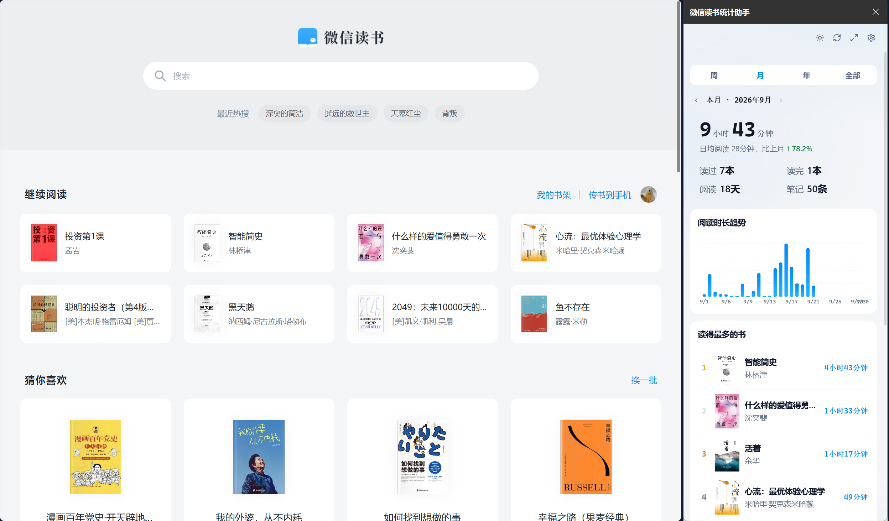

<div align="center">


# 📚 微信读书统计助手

**一款优雅的 Chrome 浏览器扩展，让你的微信读书阅读数据一目了然**

按周 / 月 / 年 / 全部查看阅读时长、读书排行与偏好分析，支持弹窗与侧边栏两种形态。

[]()
[]()
[]()
[]()
[]()

</div>

---

## 🖼 效果图

<div align="center">
  
  <p><sub>在微信读书页面中，通过浏览器右侧侧边栏查看本月阅读统计</sub></p>
</div>

## ✨ 功能特性

| 功能                | 说明                                                                    |
| ------------------- | ----------------------------------------------------------------------- |
| ⏱ **多周期统计**    | 按 **周 / 月 / 年 / 全部** 四个维度切换，支持前后翻页回溯历史周期       |
| 📊 **核心指标总览** | 总阅读时长、日均阅读、较上期涨跌幅，以及读过 / 读完 / 阅读天数 / 笔记数 |
| 📈 **阅读时长趋势** | 直观展示周期内每天 / 每月的阅读时长变化                                 |
| 🏆 **读得最多的书** | 带封面的书籍排行榜，展示每本书的累计阅读时长                            |
| 🏷 **偏好分析**     | 偏好分类、偏好作者横向对比，了解你的阅读口味                            |
| 🌙 **阅读时段分布** | 分析你的阅读习惯，还有趣味阅读习惯标签                                  |
| 🎧 **阅读方式占比** | 环形图展示「文字阅读」与「听书」的时间占比                              |
| 🌗 **明暗主题**     | 支持浅色 / 深色 / 跟随系统三种主题模式                                  |
| ⚡ **缓存加速**     | 会话级缓存 + 10 分钟数据缓存，打开即达，无需重复请求                    |

## 📦 安装

> 需要 **Chrome 114** 或更高版本（支持 Chrome Side Panel API）

1. `git clone` 或下载本仓库到本地
2. 打开 Chrome，地址栏输入 `chrome://extensions/` 进入扩展管理页
3. 打开右上角的 **「开发者模式」**
4. 点击 **「加载已解压的扩展程序」**，选择本仓库中的 `weread-stats-extension` 文件夹
5. 安装完成 🎉 工具栏会出现微信读书统计图标

## 🔑 获取 API Key

首次使用需要连接微信读书账号：

1. 点击扩展图标，进入「连接微信读书」引导页
2. 前往 **[weread.qq.com/r/weread-skills](https://weread.qq.com/r/weread-skills)** 获取你的 API Key（以 `wrk-` 开头）
3. 粘贴 Key，点击「保存并连接」即可

> 🔒 API Key 仅保存在本地浏览器中，不会上传到任何第三方服务器。

## 📖 使用方法

- **工具栏弹窗**：点击浏览器工具栏中的扩展图标，随时查看统计
- **侧边栏模式**：访问 [微信读书网页版](https://weread.qq.com/) 时，可通过浏览器右侧侧边栏边读边看
- **独立标签页**：点击弹窗右上角的展开按钮 ⤢，在大屏中完整浏览
- **切换周期**：顶部 `周 / 月 / 年 / 全部` 标签页自由切换，`‹ ›` 箭头回溯历史
- **主题切换**：右上角太阳 / 月亮图标一键切换明暗主题

## 🔒 隐私与安全

- 数据通过**微信读书官方接口网关**获取，扩展不架设任何中间服务器
- API Key 仅存储于本地 `chrome.storage.local`
- 统计数据仅用于本地展示，不做任何上报与收集

## 🗂 项目结构

```
weread-stats-extension/
├── manifest.json        # Chrome MV3 扩展清单
├── dashboard.html       # 统计面板（弹窗 / 侧边栏 / 标签页共用）
├── sidepanel.html       # 侧边栏入口（内嵌 dashboard）
├── css/
│   └── style.css        # 明暗双主题样式
├── js/
│   ├── background.js    # Service Worker（侧边栏行为管理）
│   ├── api.js           # 微信读书 API 网关客户端 + 存储/缓存
│   ├── charts.js        # 手写 SVG 图表（柱状图 / 环形图 / 横向条形图）
│   └── app.js           # 主逻辑（周期切换、数据渲染、主题、设置）
└── icons/               # 扩展图标
```

## ⚠️ 免责声明

本项目为个人开发的第三方统计工具，与微信读书官方无任何关联。所有数据均来自微信读书官方接口网关的授权返回，请合理使用。

---

<div align="center">

如果这个工具对你有帮助，欢迎点一个 **Star** ⭐ 支持一下！

</div>
